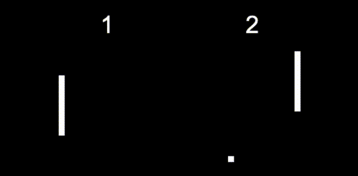

# (WIP) NetplayJS [](https://travis-ci.org/rameshvarun/netplayjs)


Make peer-to-peer WebRTC-based multiplayer games in just a few lines of Javascript, no server or network synchronization code required!

<p align="center">
  
</p>
<p align="center">
  <a href="https://rameshvarun.github.io/netplayjs/">CHECK THE DEMO</a>
</p>

## Quick Start

NetplayJS provides a protoyping framework. Add this script tag to your HTML.

```html
<script src="https://unpkg.com/netplayjs@0.2.0/dist/netplay.js"></script>
```

Add this javascript code.
```javascript
class SimpleGame extends netplayjs.Game {
  // In the constructor, we initialize the state of our game.
  constructor() {
    super();
    // Initialize our player positions.
    this.aPos = { x: 100, y: 150 };
    this.bPos = { x: 500, y: 150 };
  }

  // The tick function takes a map of Player -> Input and
  // simulates the game forward. Think of it like making
  // a local multiplayer game with multiple controllers.
  tick(playerInputs) {
    for (const [player, input] of playerInputs.entries()) {
      // Generate player velocity from input keys.
      const vel = {
        x:
          (input.pressed.ArrowLeft ? -1 : 0) +
          (input.pressed.ArrowRight ? 1 : 0),
        y:
          (input.pressed.ArrowDown ? -1 : 0) +
          (input.pressed.ArrowUp ? 1 : 0),
      };

      // Apply the velocity to the appropriate player.
      if (player.getID() == 0) {
        this.aPos.x += vel.x * 5;
        this.aPos.y -= vel.y * 5;
      } else if (player.getID() == 1) {
        this.bPos.x += vel.x * 5;
        this.bPos.y -= vel.y * 5;
      }
    }
  }

  // Normally, we have to implement a serialize / deserialize function
  // for our state. However, there is an autoserializer that can handle
  // simple states for us. We don't need to do anything here!
  // serialize() {}
  // deserialize(value) {}

  // Draw the state of our game onto a canvas.
  draw(canvas) {
    const ctx = canvas.getContext("2d");

    // Fill with black.
    ctx.fillStyle = "black";
    ctx.fillRect(0, 0, canvas.width, canvas.height);

    // Draw squares for the players.
    ctx.fillStyle = "red";
    ctx.fillRect(this.aPos.x - 5, this.aPos.y - 5, 10, 10);
    ctx.fillStyle = "blue";
    ctx.fillRect(this.bPos.x - 5, this.bPos.y - 5, 10, 10);
  }
}

SimpleGame.timestep = 1000 / 60; // Our game runs at 60 FPS
SimpleGame.canvasSize = { width: 600, height: 300 };

netplayjs.start(SimpleGame);
```

And voila - a real-time networked game with rollback and client-side prediction.

## Detailed Usage

NetplayJS is powered by an implementation of Rollback netcode (like GGPO) in Javascript. The library is written in TypeScript, and it is highly recommended that you use it with TypeScript as well.

### Installation
```bash
npm install --save netplayjs
```

```typescript
import { NetplayPlayer, DefaultInput, Game, RollbackWrapper } from "netplayjs";
```

### Game State Serialization
The client-side prediction and rewind capabilities of `netplayjs` are based off of the ability to serialize and deserialize the state of the game. In the simple example above, the autoserializer can take care of rewinding our states and sending them over a network. For most games, however, you will need to implement your own logic. You can do this by overriding `Game.serialize` and `Game.deserialize` in your subclass.

## Advanced Usage
If you want to integrate rollback into an existing game, or otherwise find the prototyping framework too restrictive, you can use the core netcode implementations. These implementations are abstract enough to be used in any project.

```
let rollbackNetcode = new RollbackNetcode(...)
rollbackNetcode.start();
```
