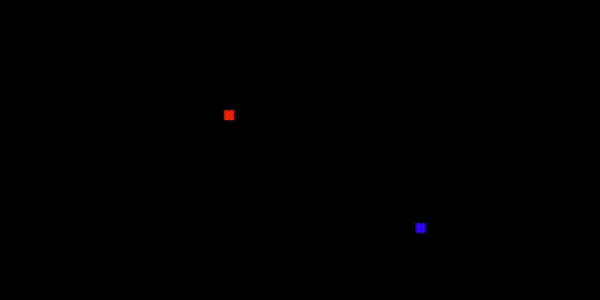

# NetplayJS 
[](https://github.com/rameshvarun/netplayjs/actions/workflows/node.js.yml) [](https://www.npmjs.com/package/netplayjs)

Make peer-to-peer WebRTC-based multiplayer games in JavaScript, no server hosting or network synchronization code required!

<p align="center">
  <a href="https://rameshvarun.github.io/netplayjs/"></a>
</p>
<p align="center">
  <a href="https://rameshvarun.github.io/netplayjs/">[CHECK OUT THE DEMOS]</a>
</p>

## Quick Start

 <a href="https://glitch.com/edit/#!/remix/netplayjs-simple-v2"></a>
 
 Here's how NetplayJS works:

- You create your game within a single static HTML file.
- You can use a variety of HTML5 game frameworks, including [Three.js](https://threejs.org/).
- You can host this file anywhere ([GitHub Pages](https://pages.github.com/), [Itch.io](https://itch.io/), [Glitch](https://glitch.com/), and many more).

NetplayJS handles most of the complicated aspects of multiplayer game development, letting you create games *almost* as if they were local multiplayer games. Synchronization and matchmaking are handled automatically under the hood - and best of all you don't have to host any servers!

Let's make a very simple game. Create an HTML file and add the following script tag.

```html
<script src="https://unpkg.com/netplayjs@0.4.1/dist/netplay.js"></script>
```

Now add this javascript code to the same HTML.
```html
<script>
class SimpleGame extends netplayjs.Game {
  // In the constructor, we initialize the state of our game.
  constructor() {
    super();
    // Initialize our player positions.
    this.aPos = { x: 100, y: 150 };
    this.bPos = { x: 500, y: 150 };
  }

  // The tick function takes a map of Player -> Input and
  // simulates the game forward. Think of it like making
  // a local multiplayer game with multiple controllers.
  tick(playerInputs) {
    for (const [player, input] of playerInputs.entries()) {
      // Generate player velocity from input keys.
      const vel = input.arrowKeys();

      // Apply the velocity to the appropriate player.
      if (player.getID() == 0) {
        this.aPos.x += vel.x * 5;
        this.aPos.y -= vel.y * 5;
      } else if (player.getID() == 1) {
        this.bPos.x += vel.x * 5;
        this.bPos.y -= vel.y * 5;
      }
    }
  }

  // Normally, we have to implement a serialize / deserialize function
  // for our state. However, there is an autoserializer that can handle
  // simple states for us. We don't need to do anything here!
  // serialize() {}
  // deserialize(value) {}

  // Draw the state of our game onto a canvas.
  draw(canvas) {
    const ctx = canvas.getContext("2d");

    // Fill with black.
    ctx.fillStyle = "black";
    ctx.fillRect(0, 0, canvas.width, canvas.height);

    // Draw squares for the players.
    ctx.fillStyle = "red";
    ctx.fillRect(this.aPos.x - 5, this.aPos.y - 5, 10, 10);
    ctx.fillStyle = "blue";
    ctx.fillRect(this.bPos.x - 5, this.bPos.y - 5, 10, 10);
  }
}

SimpleGame.timestep = 1000 / 60; // Our game runs at 60 FPS
SimpleGame.canvasSize = { width: 600, height: 300 };

// Because our game can be easily rewound, we will use Rollback netcode
// If your game cannot be rewound, you should use LockstepWrapper instead.
new netplayjs.RollbackWrapper(SimpleGame).start();
</script>
```

And voila - a real-time networked game with rollback and client-side prediction.

<p align="center">
  
</p>

## Overview

NetplayJS is a framework designed to make the process of creating multiplayer browser games simple and fun. It consists of several different components.

- [`netplayjs-server`](https://github.com/rameshvarun/netplayjs/tree/master/netplayjs-server) - The matchmaking and signaling server. You can host your own or use the public instance.
- (WIP) `netplayjs-netcode` - Implementations of rollback netcode and lockstep netcode.
- (WIP) `netplayjs-connection` - The client side code that communicates with the matchmaking server to establish connections.
- `netplayjs` - A prototyping framework that lets you rapidly create multiplayer games.
- `netplayjs-demos` - A collection of demos built in `netplayjs` to show off how to use it.

## Installation

For simple usage, you can include NetplayJS directly from a script tag in an HTML file.
```html
<script src="https://unpkg.com/netplayjs@0.4.1/dist/netplay.js"></script>
```

For larger projects, you should install NetplayJS from npm and bundle it with your application using Webpack or a similar module bundler.
```bash
npm install --save netplayjs
```

I also highly recommend that you use it with TypeScript, though this is not required. The examples following will be in TypeScript.

## Usage

To create a game using NetplayJS, you create a new class that extends `netplayjs.Game`.
- This class should implement functions for initializing, updating, and drawing the game.
- It should implement functions for serializing / deserializing the state (more info in the next section).
- It should contain static properties used to configure the netcode ([see here](https://github.com/rameshvarun/netplayjs/blob/master/netplayjs-client/src/game.ts)).

```typescript
class MyGame extends netplayjs.Game {
  // NetplayJS games use a fixed timestep.
  static timestep = 1000 / 60;

  // NetplayJS games use a fixed canvas size.
  static canvasSize = { width: 600, height: 300 };

  // Initialize the game state.
  constructor(canvas: HTMLCanvasElement, players: Array<NetplayPlayer>) {}

  // Tick the game state forward given the inputs for each player.
  tick(playerInputs: Map<NetplayPlayer, DefaultInput>): void {}

  // Draw the current state of the game to a canvas.
  draw(canvas: HTMLCanvasElement) {}

  // Serialize the state of a game to JSON-compatible value.
  serialize(): JsonValue {}

  // Load the state of a game from a serialized JSON value.
  deserialize(value: JsonValue) {}
}
```

You can now start the game by passing your game class to one of several wrappers.
- `new LocalWrapper(MyGame).start();` - Runs mutiple instances of the game in the same browser page. Use for local testing and rapid iteration.
- `new RollbackWrapper(MyGame).start();` - Runs the game using rollback netcode. Use for game states that can be rewound and replayed.
- `new LockstepWrapper(MyGame).start();` - Runs the game using lockstep netcode. Use for game states that can't be rewound.

### Game State Serialization
The client-side prediction and rewind capabilities of `netplayjs` are based off of the ability to serialize and deserialize the state of the game. In the quickstart example above, we let the autoserializer take care of this. For most games, however, you will need to implement your own logic. You can do this by overriding `Game.serialize` and `Game.deserialize` in your subclass.

If you cannot serialize the game state, you can still use NetplayJS, but you will need to use Lockstep netcode, rather than predictive netcodes like Rollback, and you need to mark your game as deterministic.

### `NetplayPlayer`

A `NetplayPlayer` represents one player in a game. `NetplayPlayer.getID()` returns an ID that is stable across each network replication of the game.

### `DefaultInput`
NetplayJS games are synchronized by sending inputs across a network. `DefaultInput` automatically captures and replicates keyboard events, mouse events, and touch events.

## FAQ

### Does NetplayJS require game code to be deterministic?

NetplayJS **does not require game code to be deterministic**, but is more efficient if it is. By default, NetplayJS corrects for drift by having one player (the host) send authoritative state updates to the others. NetplayJS will skip these updates if you explicitly mark your game as being deterministic.

Whether or not JavaScript operations are cross-platform deterministic is a difficult question. Here's what I know:
- Integer arithmatic can be assumed to be deterministic.
- In WASM code, floating point operations are cross-platform deterministic, with the exception of the bit pattern of NaN values.
  - This means that WASM physics engines like Ammo.js can be assumed to be deterministic.
- Anything else is potentially up in the air.

### Can NetplayJS be used with Unity, Godot, PlayCanvas, etc?

NetplayJS works best with lightweight game frameworks. The reason is we need game state to be kept in one place, so that it's easy to replicate across the network

Other engines tend to have complicated entity systems with their own state management, and wont fit nicely into the NetplayJS state model.

One way to get around this is to essentially create an invisible NetplayJS game that runs in the background and describes the actual game logic. Then, on `draw()`, instead of drawing directly, use the current game state to update the entities in your game engine's scene.

## Assets Used from Other Projects
This repo contains code and assets from other open source projects.
- https://github.com/mrdoob/three.js (MIT)
- https://github.com/pinobatch/allpads-nes (zlib)
- https://github.com/kripken/ammo.js (zlib)
